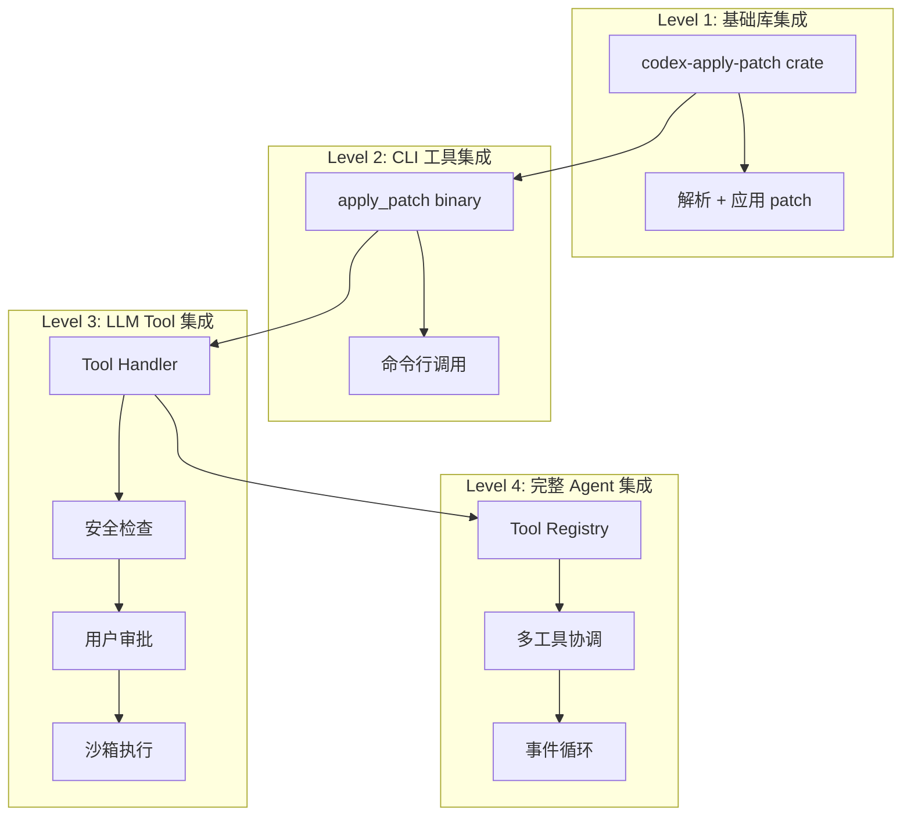
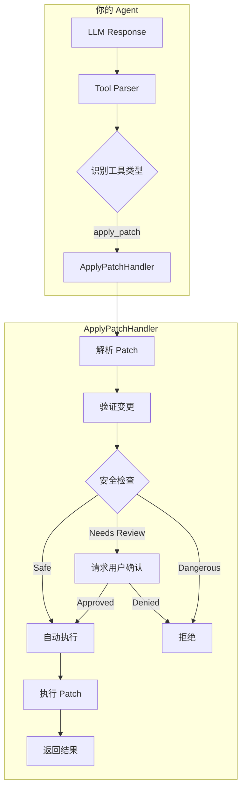
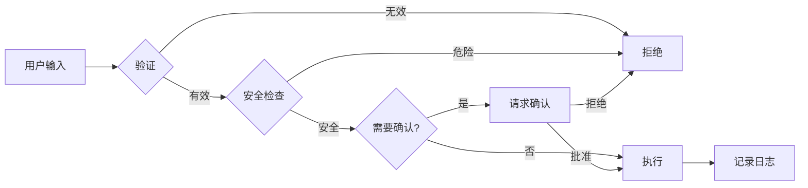

# Codex Apply Patch 集成指南

本文档详细说明如何将 Codex 的 `apply_patch` 工具集成到你自己的项目中。

## 1. 集成层次概览

根据你的需求，可以选择不同层次的集成：



| 层次 | 适用场景 | 复杂度 | 需要的组件 |
|------|----------|--------|-----------|
| Level 1 | 简单脚本/工具 | 低 | 仅 `codex-apply-patch` crate |
| Level 2 | CLI 工具链 | 低 | `apply_patch` 二进制 |
| Level 3 | AI Agent | 中 | Handler + Runtime |
| Level 4 | 完整 Agent 系统 | 高 | 整个 codex-core |

## 2. Level 1: 基础库集成

### 2.1 添加依赖

**方式 A：直接从源码引用**

```toml
# Cargo.toml
[dependencies]
codex-apply-patch = { path = "path/to/codex-rs/apply-patch" }
```

**方式 B：复制 crate 到你的项目**

将 `codex-rs/apply-patch` 目录复制到你的项目，然后：

```toml
# Cargo.toml
[dependencies]
codex-apply-patch = { path = "./apply-patch" }

# 同时需要添加这些依赖
anyhow = "1"
similar = "2.7.0"
thiserror = "2.0.17"
tree-sitter = "0.25.10"
tree-sitter-bash = "0.25"
```

### 2.2 基本使用

```rust
use codex_apply_patch::{apply_patch, parse_patch, Hunk};
use std::io::{stdout, stderr};

fn main() -> anyhow::Result<()> {
    let patch = r#"*** Begin Patch
*** Add File: hello.txt
+Hello, world!
+This is a new file.
*** End Patch"#;

    // 方式 1：直接应用 patch
    let mut stdout = stdout();
    let mut stderr = stderr();
    apply_patch(patch, &mut stdout, &mut stderr)?;

    // 方式 2：先解析再处理
    let args = parse_patch(patch)?;
    for hunk in &args.hunks {
        match hunk {
            Hunk::AddFile { path, contents } => {
                println!("Adding file: {:?}", path);
                println!("Contents:\n{}", contents);
            }
            Hunk::DeleteFile { path } => {
                println!("Deleting file: {:?}", path);
            }
            Hunk::UpdateFile { path, move_path, chunks } => {
                println!("Updating file: {:?}", path);
                if let Some(new_path) = move_path {
                    println!("  Moving to: {:?}", new_path);
                }
                println!("  {} chunks to apply", chunks.len());
            }
        }
    }

    Ok(())
}
```

### 2.3 验证并获取详细变更

```rust
use codex_apply_patch::{
    maybe_parse_apply_patch_verified,
    MaybeApplyPatchVerified,
    ApplyPatchFileChange,
};
use std::path::Path;

fn verify_and_preview_patch(patch: &str, cwd: &Path) {
    // 构建命令参数（模拟 apply_patch 调用）
    let argv = vec!["apply_patch".to_string(), patch.to_string()];

    match maybe_parse_apply_patch_verified(&argv, cwd) {
        MaybeApplyPatchVerified::Body(action) => {
            println!("Patch is valid. Changes to be applied:");
            for (path, change) in action.changes() {
                match change {
                    ApplyPatchFileChange::Add { content } => {
                        println!("  + ADD: {:?} ({} bytes)", path, content.len());
                    }
                    ApplyPatchFileChange::Delete { content } => {
                        println!("  - DELETE: {:?} ({} bytes)", path, content.len());
                    }
                    ApplyPatchFileChange::Update { unified_diff, move_path, new_content } => {
                        println!("  ~ UPDATE: {:?}", path);
                        if let Some(new_path) = move_path {
                            println!("    -> MOVE TO: {:?}", new_path);
                        }
                        println!("    Diff:\n{}", unified_diff);
                    }
                }
            }
        }
        MaybeApplyPatchVerified::CorrectnessError(e) => {
            eprintln!("Patch validation failed: {}", e);
        }
        MaybeApplyPatchVerified::ShellParseError(e) => {
            eprintln!("Shell parsing error: {:?}", e);
        }
        MaybeApplyPatchVerified::NotApplyPatch => {
            eprintln!("Input is not an apply_patch command");
        }
    }
}
```

### 2.4 处理 Shell Heredoc 格式

```rust
use codex_apply_patch::{maybe_parse_apply_patch, MaybeApplyPatch};

fn parse_shell_command(shell_command: &str) {
    // 支持解析 bash -lc 'cd /path && apply_patch <<EOF...' 格式
    let argv = vec![
        "bash".to_string(),
        "-lc".to_string(),
        shell_command.to_string(),
    ];

    match maybe_parse_apply_patch(&argv) {
        MaybeApplyPatch::Body(args) => {
            println!("Parsed successfully!");
            println!("Working directory: {:?}", args.workdir);
            println!("Hunks: {}", args.hunks.len());
        }
        MaybeApplyPatch::PatchParseError(e) => {
            eprintln!("Patch parse error: {}", e);
        }
        MaybeApplyPatch::ShellParseError(e) => {
            eprintln!("Shell parse error: {:?}", e);
        }
        MaybeApplyPatch::NotApplyPatch => {
            eprintln!("Not an apply_patch command");
        }
    }
}
```

## 3. Level 2: CLI 工具集成

### 3.1 编译 apply_patch 二进制

```bash
cd codex-rs/apply-patch
cargo build --release
# 二进制位于 target/release/apply_patch
```

### 3.2 在你的程序中调用

```rust
use std::process::Command;
use std::path::Path;

fn apply_patch_via_cli(patch: &str, working_dir: &Path) -> anyhow::Result<String> {
    let output = Command::new("apply_patch")
        .arg(patch)
        .current_dir(working_dir)
        .output()?;

    if output.status.success() {
        Ok(String::from_utf8_lossy(&output.stdout).to_string())
    } else {
        Err(anyhow::anyhow!(
            "apply_patch failed: {}",
            String::from_utf8_lossy(&output.stderr)
        ))
    }
}

// 或者通过 stdin 传递 patch
fn apply_patch_via_stdin(patch: &str, working_dir: &Path) -> anyhow::Result<String> {
    use std::io::Write;
    use std::process::Stdio;

    let mut child = Command::new("apply_patch")
        .current_dir(working_dir)
        .stdin(Stdio::piped())
        .stdout(Stdio::piped())
        .stderr(Stdio::piped())
        .spawn()?;

    if let Some(mut stdin) = child.stdin.take() {
        stdin.write_all(patch.as_bytes())?;
    }

    let output = child.wait_with_output()?;

    if output.status.success() {
        Ok(String::from_utf8_lossy(&output.stdout).to_string())
    } else {
        Err(anyhow::anyhow!(
            "apply_patch failed: {}",
            String::from_utf8_lossy(&output.stderr)
        ))
    }
}
```

### 3.3 Python 调用示例

```python
import subprocess
from pathlib import Path

def apply_patch(patch: str, working_dir: Path) -> str:
    """Apply a patch using the apply_patch CLI tool."""
    result = subprocess.run(
        ["apply_patch", patch],
        cwd=working_dir,
        capture_output=True,
        text=True,
    )

    if result.returncode != 0:
        raise RuntimeError(f"apply_patch failed: {result.stderr}")

    return result.stdout

# 使用示例
patch = """*** Begin Patch
*** Add File: hello.py
+print("Hello, world!")
*** End Patch"""

output = apply_patch(patch, Path("."))
print(output)
```

## 4. Level 3: LLM Tool 集成

### 4.1 架构概览



### 4.2 实现 Tool Handler

```rust
use codex_apply_patch::{
    maybe_parse_apply_patch_verified,
    MaybeApplyPatchVerified,
    ApplyPatchAction,
    apply_patch,
};
use std::path::{Path, PathBuf};
use std::io::Cursor;

/// 安全策略
#[derive(Clone)]
pub struct SafetyPolicy {
    /// 允许写入的目录
    pub writable_roots: Vec<PathBuf>,
    /// 是否需要用户确认
    pub require_confirmation: bool,
}

/// 安全检查结果
pub enum SafetyCheck {
    AutoApprove,
    NeedsConfirmation { changes: Vec<(PathBuf, String)> },
    Reject { reason: String },
}

/// 检查 patch 是否安全
pub fn check_patch_safety(
    action: &ApplyPatchAction,
    policy: &SafetyPolicy,
) -> SafetyCheck {
    let changes = action.changes();

    // 检查所有变更是否在允许的目录内
    for (path, _change) in changes {
        let is_allowed = policy.writable_roots.iter().any(|root| {
            path.starts_with(root)
        });

        if !is_allowed {
            return SafetyCheck::Reject {
                reason: format!(
                    "Path {:?} is not within allowed writable roots",
                    path
                ),
            };
        }
    }

    if policy.require_confirmation {
        let change_summary: Vec<_> = changes
            .iter()
            .map(|(path, change)| {
                let desc = match change {
                    codex_apply_patch::ApplyPatchFileChange::Add { .. } => "ADD",
                    codex_apply_patch::ApplyPatchFileChange::Delete { .. } => "DELETE",
                    codex_apply_patch::ApplyPatchFileChange::Update { .. } => "UPDATE",
                };
                (path.clone(), desc.to_string())
            })
            .collect();
        SafetyCheck::NeedsConfirmation { changes: change_summary }
    } else {
        SafetyCheck::AutoApprove
    }
}

/// Tool Handler 实现
pub struct ApplyPatchToolHandler {
    pub working_dir: PathBuf,
    pub safety_policy: SafetyPolicy,
}

impl ApplyPatchToolHandler {
    pub fn new(working_dir: PathBuf, safety_policy: SafetyPolicy) -> Self {
        Self { working_dir, safety_policy }
    }

    /// 处理 apply_patch 工具调用
    pub async fn handle(
        &self,
        patch_input: &str,
        confirmation_callback: impl Fn(Vec<(PathBuf, String)>) -> bool,
    ) -> Result<String, String> {
        // 1. 解析并验证 patch
        let argv = vec!["apply_patch".to_string(), patch_input.to_string()];
        let action = match maybe_parse_apply_patch_verified(&argv, &self.working_dir) {
            MaybeApplyPatchVerified::Body(action) => action,
            MaybeApplyPatchVerified::CorrectnessError(e) => {
                return Err(format!("Patch validation failed: {}", e));
            }
            MaybeApplyPatchVerified::ShellParseError(e) => {
                return Err(format!("Shell parsing error: {:?}", e));
            }
            MaybeApplyPatchVerified::NotApplyPatch => {
                return Err("Input is not a valid apply_patch command".to_string());
            }
        };

        // 2. 安全检查
        match check_patch_safety(&action, &self.safety_policy) {
            SafetyCheck::AutoApprove => {
                // 直接执行
            }
            SafetyCheck::NeedsConfirmation { changes } => {
                if !confirmation_callback(changes) {
                    return Err("User rejected the patch".to_string());
                }
            }
            SafetyCheck::Reject { reason } => {
                return Err(format!("Patch rejected: {}", reason));
            }
        }

        // 3. 执行 patch
        let mut stdout = Cursor::new(Vec::new());
        let mut stderr = Cursor::new(Vec::new());

        match apply_patch(&action.patch, &mut stdout, &mut stderr) {
            Ok(()) => {
                let output = String::from_utf8_lossy(&stdout.into_inner()).to_string();
                Ok(output)
            }
            Err(e) => {
                let err_output = String::from_utf8_lossy(&stderr.into_inner()).to_string();
                Err(format!("{}: {}", e, err_output))
            }
        }
    }
}
```

### 4.3 为 LLM 生成工具说明

```rust
use codex_apply_patch::APPLY_PATCH_TOOL_INSTRUCTIONS;

/// 获取工具说明（用于 system prompt）
pub fn get_tool_instructions() -> &'static str {
    APPLY_PATCH_TOOL_INSTRUCTIONS
}

/// 生成 OpenAI 格式的工具定义
pub fn get_openai_tool_definition() -> serde_json::Value {
    serde_json::json!({
        "type": "function",
        "function": {
            "name": "apply_patch",
            "description": get_tool_instructions(),
            "parameters": {
                "type": "object",
                "properties": {
                    "input": {
                        "type": "string",
                        "description": "The patch content in apply_patch format"
                    }
                },
                "required": ["input"]
            }
        }
    })
}

/// 生成 Anthropic 格式的工具定义
pub fn get_anthropic_tool_definition() -> serde_json::Value {
    serde_json::json!({
        "name": "apply_patch",
        "description": get_tool_instructions(),
        "input_schema": {
            "type": "object",
            "properties": {
                "input": {
                    "type": "string",
                    "description": "The patch content in apply_patch format"
                }
            },
            "required": ["input"]
        }
    })
}
```

### 4.4 完整的 Agent 集成示例

```rust
use serde::{Deserialize, Serialize};

#[derive(Deserialize)]
struct ToolCall {
    name: String,
    arguments: serde_json::Value,
}

#[derive(Serialize)]
struct ToolResult {
    tool_call_id: String,
    output: String,
    success: bool,
}

pub struct MyAgent {
    apply_patch_handler: ApplyPatchToolHandler,
    // 其他工具...
}

impl MyAgent {
    pub async fn handle_tool_call(&self, tool_call: ToolCall) -> ToolResult {
        match tool_call.name.as_str() {
            "apply_patch" => {
                let input = tool_call.arguments
                    .get("input")
                    .and_then(|v| v.as_str())
                    .unwrap_or("");

                // 使用终端确认
                let confirm = |changes: Vec<(PathBuf, String)>| {
                    println!("The following changes will be made:");
                    for (path, action) in &changes {
                        println!("  {} {:?}", action, path);
                    }
                    print!("Approve? [y/N] ");
                    use std::io::{self, Write};
                    io::stdout().flush().unwrap();

                    let mut input = String::new();
                    io::stdin().read_line(&mut input).unwrap();
                    input.trim().to_lowercase() == "y"
                };

                match self.apply_patch_handler.handle(input, confirm).await {
                    Ok(output) => ToolResult {
                        tool_call_id: "...".to_string(),
                        output,
                        success: true,
                    },
                    Err(e) => ToolResult {
                        tool_call_id: "...".to_string(),
                        output: e,
                        success: false,
                    },
                }
            }
            _ => ToolResult {
                tool_call_id: "...".to_string(),
                output: format!("Unknown tool: {}", tool_call.name),
                success: false,
            },
        }
    }
}
```

## 5. Level 4: 高级功能

### 5.1 自定义模糊匹配

如果你需要自定义模糊匹配行为，可以参考 `seek_sequence.rs` 的实现：

```rust
/// 自定义匹配器
pub trait LineMatcher {
    fn matches(&self, file_line: &str, pattern_line: &str) -> bool;
}

/// 默认匹配器（多层宽松匹配）
pub struct DefaultMatcher;

impl LineMatcher for DefaultMatcher {
    fn matches(&self, file_line: &str, pattern_line: &str) -> bool {
        // 1. 精确匹配
        if file_line == pattern_line {
            return true;
        }

        // 2. 忽略尾部空白
        if file_line.trim_end() == pattern_line.trim_end() {
            return true;
        }

        // 3. 忽略首尾空白
        if file_line.trim() == pattern_line.trim() {
            return true;
        }

        // 4. Unicode 标准化
        self.normalize(file_line) == self.normalize(pattern_line)
    }
}

impl DefaultMatcher {
    fn normalize(&self, s: &str) -> String {
        s.trim()
            .chars()
            .map(|c| match c {
                // 各种 dash → ASCII '-'
                '\u{2010}'..='\u{2015}' | '\u{2212}' => '-',
                // 花式引号 → ASCII 引号
                '\u{2018}' | '\u{2019}' => '\'',
                '\u{201C}' | '\u{201D}' => '"',
                // 特殊空格 → 普通空格
                '\u{00A0}' | '\u{2002}'..='\u{200A}' => ' ',
                other => other,
            })
            .collect()
    }
}
```

### 5.2 实现沙箱执行

```rust
use std::process::Command;
use std::collections::HashMap;

pub struct SandboxConfig {
    /// 允许的环境变量
    pub allowed_env: Vec<String>,
    /// 超时时间（毫秒）
    pub timeout_ms: u64,
    /// 沙箱类型
    pub sandbox_type: SandboxType,
}

pub enum SandboxType {
    None,
    Firejail,
    Docker,
    // 其他沙箱类型...
}

pub fn execute_in_sandbox(
    patch: &str,
    cwd: &Path,
    config: &SandboxConfig,
) -> anyhow::Result<String> {
    let apply_patch_bin = find_apply_patch_binary()?;

    let mut cmd = match config.sandbox_type {
        SandboxType::None => {
            Command::new(&apply_patch_bin)
        }
        SandboxType::Firejail => {
            let mut cmd = Command::new("firejail");
            cmd.args([
                "--quiet",
                "--private-dev",
                "--net=none",
                &apply_patch_bin,
            ]);
            cmd
        }
        SandboxType::Docker => {
            let mut cmd = Command::new("docker");
            cmd.args([
                "run",
                "--rm",
                "--network=none",
                "-v", &format!("{}:/workspace", cwd.display()),
                "-w", "/workspace",
                "apply-patch-image",
            ]);
            cmd
        }
    };

    cmd.arg(patch);
    cmd.current_dir(cwd);

    // 最小化环境变量
    cmd.env_clear();
    for key in &config.allowed_env {
        if let Ok(val) = std::env::var(key) {
            cmd.env(key, val);
        }
    }

    let output = cmd.output()?;

    if output.status.success() {
        Ok(String::from_utf8_lossy(&output.stdout).to_string())
    } else {
        Err(anyhow::anyhow!(
            "Sandbox execution failed: {}",
            String::from_utf8_lossy(&output.stderr)
        ))
    }
}
```

### 5.3 实现 Dry Run 模式

```rust
use codex_apply_patch::{
    maybe_parse_apply_patch_verified,
    MaybeApplyPatchVerified,
    ApplyPatchFileChange,
};

pub struct DryRunResult {
    pub changes: Vec<FileChangePreview>,
    pub would_succeed: bool,
    pub errors: Vec<String>,
}

pub struct FileChangePreview {
    pub path: PathBuf,
    pub action: String,
    pub unified_diff: Option<String>,
}

pub fn dry_run(patch: &str, cwd: &Path) -> DryRunResult {
    let argv = vec!["apply_patch".to_string(), patch.to_string()];

    match maybe_parse_apply_patch_verified(&argv, cwd) {
        MaybeApplyPatchVerified::Body(action) => {
            let changes: Vec<_> = action.changes()
                .iter()
                .map(|(path, change)| {
                    match change {
                        ApplyPatchFileChange::Add { content } => FileChangePreview {
                            path: path.clone(),
                            action: "ADD".to_string(),
                            unified_diff: Some(format!("+++ {}\n{}", path.display(),
                                content.lines()
                                    .map(|l| format!("+{}", l))
                                    .collect::<Vec<_>>()
                                    .join("\n")
                            )),
                        },
                        ApplyPatchFileChange::Delete { .. } => FileChangePreview {
                            path: path.clone(),
                            action: "DELETE".to_string(),
                            unified_diff: None,
                        },
                        ApplyPatchFileChange::Update { unified_diff, move_path, .. } => {
                            FileChangePreview {
                                path: path.clone(),
                                action: if move_path.is_some() {
                                    format!("MOVE TO {:?}", move_path.as_ref().unwrap())
                                } else {
                                    "UPDATE".to_string()
                                },
                                unified_diff: Some(unified_diff.clone()),
                            }
                        }
                    }
                })
                .collect();

            DryRunResult {
                changes,
                would_succeed: true,
                errors: vec![],
            }
        }
        MaybeApplyPatchVerified::CorrectnessError(e) => DryRunResult {
            changes: vec![],
            would_succeed: false,
            errors: vec![format!("Validation error: {}", e)],
        },
        MaybeApplyPatchVerified::ShellParseError(e) => DryRunResult {
            changes: vec![],
            would_succeed: false,
            errors: vec![format!("Parse error: {:?}", e)],
        },
        MaybeApplyPatchVerified::NotApplyPatch => DryRunResult {
            changes: vec![],
            would_succeed: false,
            errors: vec!["Not a valid apply_patch command".to_string()],
        },
    }
}
```

## 6. 测试你的集成

### 6.1 单元测试

```rust
#[cfg(test)]
mod tests {
    use super::*;
    use tempfile::tempdir;

    #[test]
    fn test_add_file() {
        let tmp = tempdir().unwrap();
        let patch = r#"*** Begin Patch
*** Add File: test.txt
+Hello, world!
*** End Patch"#;

        let mut stdout = Vec::new();
        let mut stderr = Vec::new();

        // 切换到临时目录
        std::env::set_current_dir(tmp.path()).unwrap();

        apply_patch(patch, &mut stdout, &mut stderr).unwrap();

        let content = std::fs::read_to_string(tmp.path().join("test.txt")).unwrap();
        assert_eq!(content, "Hello, world!\n");
    }

    #[test]
    fn test_update_file() {
        let tmp = tempdir().unwrap();
        let file_path = tmp.path().join("existing.txt");
        std::fs::write(&file_path, "line1\nold_line\nline3\n").unwrap();

        let patch = format!(r#"*** Begin Patch
*** Update File: existing.txt
@@
 line1
-old_line
+new_line
 line3
*** End Patch"#);

        std::env::set_current_dir(tmp.path()).unwrap();

        let mut stdout = Vec::new();
        let mut stderr = Vec::new();
        apply_patch(&patch, &mut stdout, &mut stderr).unwrap();

        let content = std::fs::read_to_string(&file_path).unwrap();
        assert_eq!(content, "line1\nnew_line\nline3\n");
    }

    #[test]
    fn test_safety_check() {
        let tmp = tempdir().unwrap();
        let policy = SafetyPolicy {
            writable_roots: vec![tmp.path().to_path_buf()],
            require_confirmation: false,
        };

        // 测试允许的路径
        let allowed_patch = format!(r#"*** Begin Patch
*** Add File: {}
+content
*** End Patch"#, tmp.path().join("test.txt").display());

        let argv = vec!["apply_patch".to_string(), allowed_patch];
        if let MaybeApplyPatchVerified::Body(action) =
            maybe_parse_apply_patch_verified(&argv, tmp.path())
        {
            assert!(matches!(
                check_patch_safety(&action, &policy),
                SafetyCheck::AutoApprove
            ));
        }
    }
}
```

### 6.2 集成测试

```rust
#[cfg(test)]
mod integration_tests {
    use super::*;
    use std::process::Command;

    #[test]
    fn test_cli_integration() {
        let tmp = tempdir().unwrap();
        let patch = r#"*** Begin Patch
*** Add File: cli_test.txt
+Hello from CLI!
*** End Patch"#;

        let output = Command::new("apply_patch")
            .arg(patch)
            .current_dir(tmp.path())
            .output()
            .expect("Failed to execute apply_patch");

        assert!(output.status.success());
        assert!(tmp.path().join("cli_test.txt").exists());
    }
}
```

## 7. 常见问题与解决方案

### 7.1 编译错误

**问题**: `tree-sitter` 编译失败

```
解决方案: 确保安装了 C 编译器
# macOS
xcode-select --install

# Ubuntu
sudo apt install build-essential

# Windows
# 安装 Visual Studio Build Tools
```

### 7.2 路径问题

**问题**: 找不到文件或路径错误

```rust
// 确保使用绝对路径进行验证
let cwd = std::env::current_dir()?;
let action = maybe_parse_apply_patch_verified(&argv, &cwd);

// patch 中只能使用相对路径
let patch = r#"*** Begin Patch
*** Update File: src/main.rs   // 正确：相对路径
*** Update File: /abs/path.rs  // 错误：绝对路径
*** End Patch"#;
```

### 7.3 匹配失败

**问题**: "Failed to find expected lines"

```rust
// 解决方案 1: 增加上下文行数
let patch = r#"*** Begin Patch
*** Update File: file.py
@@ class MyClass           // 添加上下文标记
@@   def my_method():      // 多层上下文
 line_before_1
 line_before_2
 line_before_3              // 3 行上下文
-old_line
+new_line
 line_after_1
 line_after_2
 line_after_3               // 3 行上下文
*** End Patch"#;

// 解决方案 2: 检查空白字符
// apply_patch 使用模糊匹配，但仍需注意缩进一致性
```

## 8. 最佳实践

### 8.1 安全建议



1. **永远验证 patch 内容**
2. **限制可写目录**
3. **记录所有操作**
4. **实现回滚机制**

### 8.2 性能优化

```rust
// 批量处理多个 patch
pub fn apply_patches_batch(patches: &[String], cwd: &Path) -> Vec<Result<String, String>> {
    patches
        .par_iter()  // 使用 rayon 并行处理
        .map(|patch| {
            // ... 处理每个 patch
        })
        .collect()
}

// 缓存验证结果
use std::collections::HashMap;
use std::sync::RwLock;

lazy_static! {
    static ref VALIDATION_CACHE: RwLock<HashMap<String, bool>> = RwLock::new(HashMap::new());
}
```

### 8.3 错误处理

```rust
use thiserror::Error;

#[derive(Error, Debug)]
pub enum ApplyPatchIntegrationError {
    #[error("Patch parsing failed: {0}")]
    ParseError(String),

    #[error("Safety check failed: {0}")]
    SafetyError(String),

    #[error("User rejected the patch")]
    UserRejected,

    #[error("Execution failed: {0}")]
    ExecutionError(String),

    #[error("IO error: {0}")]
    IoError(#[from] std::io::Error),
}

// 使用 Result 类型进行错误处理
pub type Result<T> = std::result::Result<T, ApplyPatchIntegrationError>;
```

## 9. 总结

| 集成层次 | 适用场景 | 主要组件 | 代码量 |
|---------|----------|---------|--------|
| Level 1 | 简单工具 | `codex-apply-patch` crate | ~50 行 |
| Level 2 | CLI 集成 | `apply_patch` 二进制 | ~30 行 |
| Level 3 | AI Agent | Handler + Safety | ~200 行 |
| Level 4 | 完整系统 | 全部 + 沙箱 | ~500+ 行 |

选择合适的集成层次取决于你的需求：
- 如果只需要简单的文件编辑功能，Level 1 就足够
- 如果需要与 LLM 集成，推荐 Level 3
- 如果需要完整的安全控制和沙箱，考虑 Level 4 或参考 Codex Core 的实现
