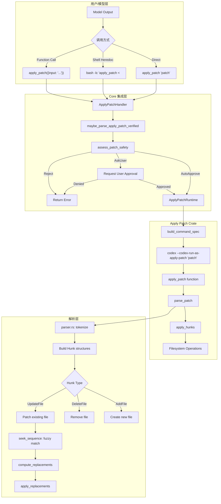
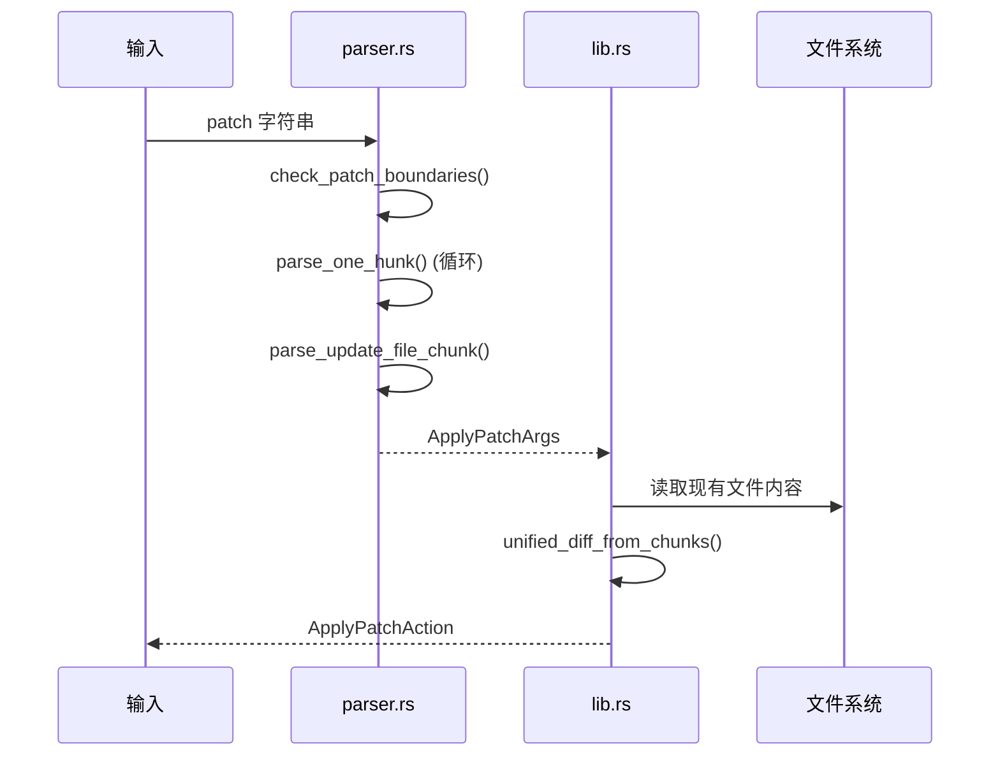
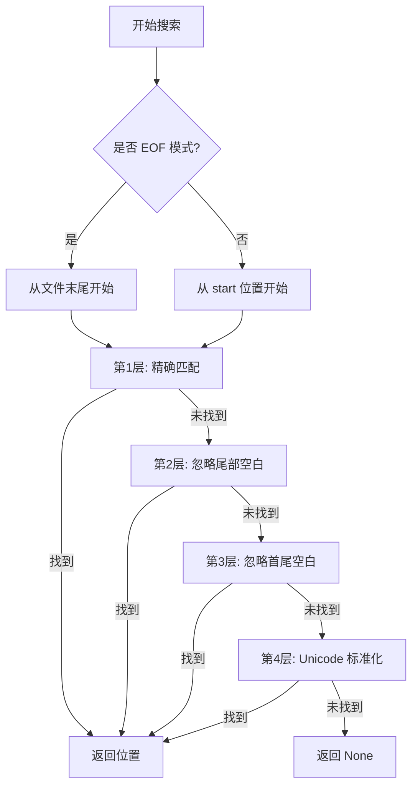
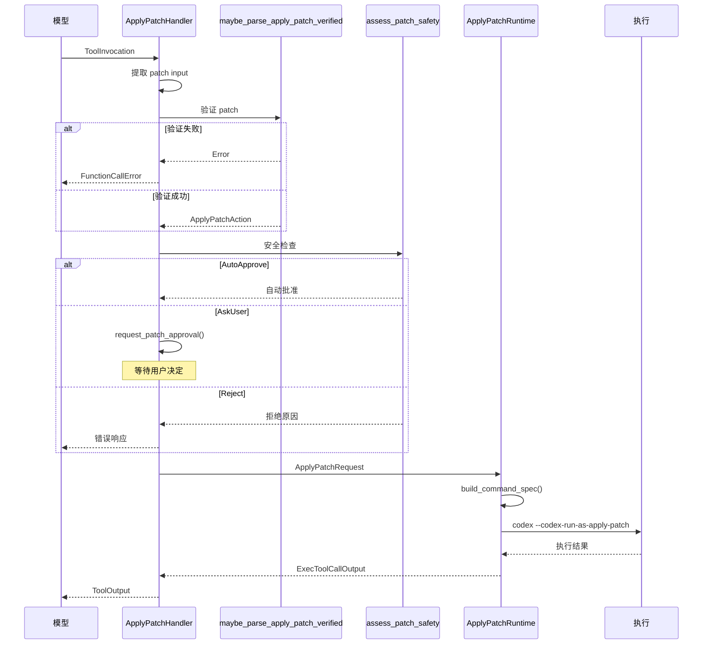
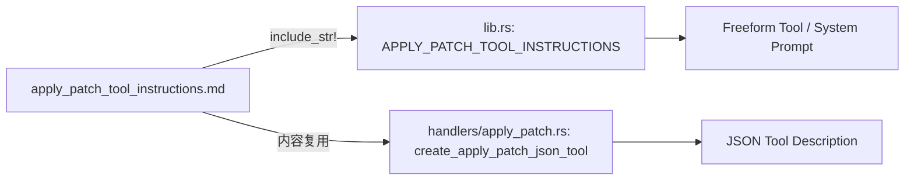

# Codex Apply Patch 工具深度解析

## 1. 概述

`apply_patch` 是 Codex 中用于安全编辑文件的核心工具。它实现了一种自定义的 patch 格式，专门为 LLM 生成的代码修改而设计，具有以下特点：

- **简洁易解析**：比传统的 unified diff 更简单，便于 LLM 生成和解析
- **安全性**：通过沙箱策略和用户审批机制确保文件操作安全
- **容错性**：支持模糊匹配，能够处理 Unicode 字符差异和空白字符差异
- **多种调用方式**：支持直接调用、shell heredoc、function call 等多种形式

## 2. 架构总览



## 3. 目录结构

```
codex-rs/
├── apply-patch/                           # apply_patch 独立 crate
│   ├── Cargo.toml
│   ├── apply_patch_tool_instructions.md   # LLM 使用说明（嵌入到 prompt）
│   ├── src/
│   │   ├── lib.rs                         # 主库实现（1766行）
│   │   ├── main.rs                        # CLI 入口
│   │   ├── parser.rs                      # patch 语法解析器
│   │   ├── seek_sequence.rs               # 模糊行匹配算法
│   │   └── standalone_executable.rs       # 独立可执行文件入口
│   └── tests/
│       ├── all.rs
│       └── suite/
│           ├── cli.rs                     # CLI 集成测试
│           ├── tool.rs                    # 工具功能测试
│           └── mod.rs
│
└── core/src/
    ├── apply_patch.rs                     # Core 集成模块（安全检查）
    └── tools/
        ├── handlers/
        │   ├── apply_patch.rs             # ToolHandler 实现
        │   └── tool_apply_patch.lark      # Lark 语法定义
        ├── runtimes/
        │   └── apply_patch.rs             # 沙箱执行运行时
        └── spec.rs                        # 工具注册和配置
```

## 4. Patch 格式规范

### 4.1 基本格式

```
*** Begin Patch
[ one or more file operations ]
*** End Patch
```

### 4.2 文件操作类型

#### Add File（添加文件）
```
*** Add File: path/to/new_file.py
+line 1
+line 2
+line 3
```

#### Delete File（删除文件）
```
*** Delete File: path/to/obsolete_file.py
```

#### Update File（更新文件）
```
*** Update File: path/to/existing_file.py
@@ def some_function():
 context_line_1
 context_line_2
-old_line
+new_line
 context_line_3
```

#### Move File（重命名文件，与 Update 配合）
```
*** Update File: old_path/file.py
*** Move to: new_path/file.py
@@
-old_content
+new_content
```

### 4.3 Hunk 语法

```
@@                           # 空上下文，从当前位置开始
@@ class MyClass              # 跳转到 class MyClass 定义处
@@ class MyClass
@@   def method():           # 嵌套上下文，先找 class 再找 method
```

每行前缀含义：
- ` `（空格）：上下文行（保持不变）
- `-`：删除行
- `+`：添加行

### 4.4 完整示例

```
*** Begin Patch
*** Add File: hello.txt
+Hello world
*** Update File: src/app.py
*** Move to: src/main.py
@@ def greet():
-print("Hi")
+print("Hello, world!")
*** Delete File: obsolete.txt
*** End Patch
```

### 4.5 Lark 语法定义

```lark
start: begin_patch hunk+ end_patch
begin_patch: "*** Begin Patch" LF
end_patch: "*** End Patch" LF?

hunk: add_hunk | delete_hunk | update_hunk
add_hunk: "*** Add File: " filename LF add_line+
delete_hunk: "*** Delete File: " filename LF
update_hunk: "*** Update File: " filename LF change_move? change?

filename: /(.+)/
add_line: "+" /(.*)/ LF -> line

change_move: "*** Move to: " filename LF
change: (change_context | change_line)+ eof_line?
change_context: ("@@" | "@@ " /(.+)/) LF
change_line: ("+" | "-" | " ") /(.*)/ LF
eof_line: "*** End of File" LF
```

## 5. 核心实现详解

### 5.1 主要数据结构

```rust
// 解析后的 patch 参数
pub struct ApplyPatchArgs {
    pub patch: String,           // 原始 patch 字符串
    pub hunks: Vec<Hunk>,        // 解析后的 hunk 列表
    pub workdir: Option<String>, // 工作目录（用于 heredoc 中的 cd）
}

// Hunk 类型
pub enum Hunk {
    AddFile {
        path: PathBuf,
        contents: String,
    },
    DeleteFile {
        path: PathBuf,
    },
    UpdateFile {
        path: PathBuf,
        move_path: Option<PathBuf>,
        chunks: Vec<UpdateFileChunk>,  // 多个修改块
    },
}

// 更新文件的单个修改块
pub struct UpdateFileChunk {
    pub change_context: Option<String>, // @@ 后的上下文
    pub old_lines: Vec<String>,         // 要替换的旧行
    pub new_lines: Vec<String>,         // 新行
    pub is_end_of_file: bool,           // 是否在文件末尾
}

// 验证后的 patch action（包含完整路径和 diff）
pub struct ApplyPatchAction {
    changes: HashMap<PathBuf, ApplyPatchFileChange>,
    pub patch: String,
    pub cwd: PathBuf,
}

pub enum ApplyPatchFileChange {
    Add { content: String },
    Delete { content: String },
    Update {
        unified_diff: String,           // 生成的 unified diff
        move_path: Option<PathBuf>,
        new_content: String,            // 应用后的新内容
    },
}
```

### 5.2 解析流程



**关键函数**：

1. **`parse_patch()`** (`parser.rs:106`)
   - 检查边界标记 (`*** Begin Patch`, `*** End Patch`)
   - 支持宽松模式（lenient mode）处理 heredoc 包装

2. **`parse_one_hunk()`** (`parser.rs:245`)
   - 识别 hunk 类型（Add/Delete/Update）
   - 解析文件路径和内容

3. **`parse_update_file_chunk()`** (`parser.rs:340`)
   - 解析 `@@` 上下文标记
   - 提取 old_lines 和 new_lines

### 5.3 模糊匹配算法 (seek_sequence)

`seek_sequence.rs` 实现了一个多层次的模糊匹配算法，用于在文件中定位要修改的代码块：



**Unicode 标准化规则**：

```rust
fn normalise(s: &str) -> String {
    s.trim()
        .chars()
        .map(|c| match c {
            // 各种 dash/hyphen → ASCII '-'
            '\u{2010}' | '\u{2011}' | '\u{2012}' | '\u{2013}' |
            '\u{2014}' | '\u{2015}' | '\u{2212}' => '-',
            // 花式单引号 → '\''
            '\u{2018}' | '\u{2019}' | '\u{201A}' | '\u{201B}' => '\'',
            // 花式双引号 → '"'
            '\u{201C}' | '\u{201D}' | '\u{201E}' | '\u{201F}' => '"',
            // 各种空格 → 普通空格
            '\u{00A0}' | '\u{2002}' ... => ' ',
            other => other,
        })
        .collect()
}
```

### 5.4 应用替换

```rust
fn compute_replacements(
    original_lines: &[String],
    path: &Path,
    chunks: &[UpdateFileChunk],
) -> Result<Vec<(usize, usize, Vec<String>)>, ApplyPatchError>
```

该函数：
1. 对每个 chunk，使用 `seek_sequence` 找到匹配位置
2. 处理 `change_context` 来定位代码块
3. 生成 `(start_idx, old_len, new_lines)` 替换元组

```rust
fn apply_replacements(
    mut lines: Vec<String>,
    replacements: &[(usize, usize, Vec<String>)],
) -> Vec<String>
```

该函数：
- **逆序应用**替换，避免索引偏移问题
- 先删除旧行，再插入新行

## 6. Core 集成

### 6.1 Handler 注册

`spec.rs:1040-1049`:
```rust
if let Some(apply_patch_tool_type) = &config.apply_patch_tool_type {
    match apply_patch_tool_type {
        ApplyPatchToolType::Freeform => {
            builder.push_spec(create_apply_patch_freeform_tool());
        }
        ApplyPatchToolType::Function => {
            builder.push_spec(create_apply_patch_json_tool());
        }
    }
    builder.register_handler("apply_patch", apply_patch_handler);
}
```

### 6.2 ApplyPatchHandler



### 6.3 安全检查 (apply_patch.rs)

```rust
pub(crate) async fn apply_patch(
    sess: &Session,
    turn_context: &TurnContext,
    call_id: &str,
    action: ApplyPatchAction,
) -> InternalApplyPatchInvocation {
    match assess_patch_safety(&action, ...) {
        SafetyCheck::AutoApprove { .. } => {
            // 自动批准，委托给 exec
            InternalApplyPatchInvocation::DelegateToExec(ApplyPatchExec { ... })
        }
        SafetyCheck::AskUser => {
            // 请求用户审批
            let rx_approve = sess.request_patch_approval(...).await;
            match rx_approve.await.unwrap_or_default() {
                ReviewDecision::Approved | ReviewDecision::ApprovedForSession => {
                    InternalApplyPatchInvocation::DelegateToExec(...)
                }
                ReviewDecision::Denied | ReviewDecision::Abort => {
                    InternalApplyPatchInvocation::Output(Err(...))
                }
            }
        }
        SafetyCheck::Reject { reason } => {
            InternalApplyPatchInvocation::Output(Err(...))
        }
    }
}
```

### 6.4 沙箱运行时 (runtimes/apply_patch.rs)

```rust
impl ApplyPatchRuntime {
    fn build_command_spec(req: &ApplyPatchRequest) -> Result<CommandSpec, ToolError> {
        let exe = env::current_exe()?;  // 获取 codex 可执行文件路径
        Ok(CommandSpec {
            program: exe.to_string_lossy().to_string(),
            args: vec![
                CODEX_APPLY_PATCH_ARG1.to_string(),  // "--codex-run-as-apply-patch"
                req.patch.clone(),
            ],
            cwd: req.cwd.clone(),
            env: HashMap::new(),  // 最小环境变量
            ...
        })
    }
}

impl ToolRuntime<ApplyPatchRequest, ExecToolCallOutput> for ApplyPatchRuntime {
    async fn run(&mut self, req: &ApplyPatchRequest, ...) -> Result<ExecToolCallOutput, ToolError> {
        let spec = Self::build_command_spec(req)?;
        let env = attempt.env_for(spec)?;
        let out = execute_env(env, attempt.policy, ...).await?;
        Ok(out)
    }
}
```

## 7. apply_patch_tool_instructions.md 的作用

### 7.1 文件位置

`apply-patch/apply_patch_tool_instructions.md`

### 7.2 嵌入机制

```rust
// lib.rs:30
pub const APPLY_PATCH_TOOL_INSTRUCTIONS: &str =
    include_str!("../apply_patch_tool_instructions.md");
```

该文件在编译时被嵌入到 `codex_apply_patch` crate 中，作为常量字符串。

### 7.3 用途

1. **LLM System Prompt**：作为 GPT-4.1 等模型的工具使用说明
2. **文档来源**：JSON tool description 中复用此内容
3. **一致性**：确保 LLM 看到的说明与实际实现保持一致

### 7.4 内容结构

```markdown
## `apply_patch`

Use the `apply_patch` shell command to edit files.
Your patch language is a stripped‑down, file‑oriented diff format...

*** Begin Patch
[ one or more file sections ]
*** End Patch

Within that envelope, you get a sequence of file operations:
- *** Add File: <path>
- *** Delete File: <path>
- *** Update File: <path>

[语法规则说明...]
[使用示例...]
[注意事项...]
```

### 7.5 与 handlers/apply_patch.rs 的关系



`create_apply_patch_json_tool()` 函数直接在代码中硬编码了与 instructions.md 相似的内容，用于 JSON function tool 的 description 字段。

## 8. 工具类型

### 8.1 Freeform Tool

适用于 GPT-4.1 等模型，使用 Lark 语法约束输出：

```rust
pub(crate) fn create_apply_patch_freeform_tool() -> ToolSpec {
    ToolSpec::Freeform(FreeformTool {
        name: "apply_patch".to_string(),
        description: "Use the `apply_patch` tool to edit files...".to_string(),
        format: FreeformToolFormat {
            r#type: "grammar".to_string(),
            syntax: "lark".to_string(),
            definition: APPLY_PATCH_LARK_GRAMMAR.to_string(),  // 使用 Lark 语法
        },
    })
}
```

### 8.2 Function Tool

适用于其他模型，使用 JSON schema：

```rust
pub(crate) fn create_apply_patch_json_tool() -> ToolSpec {
    ToolSpec::Function(ResponsesApiTool {
        name: "apply_patch".to_string(),
        description: r#"Use the `apply_patch` tool to edit files..."#.to_string(),
        parameters: JsonSchema::Object {
            properties: [("input", JsonSchema::String { ... })],
            required: Some(vec!["input".to_string()]),
            ...
        },
    })
}
```

## 9. 测试策略

### 9.1 单元测试

位于 `apply-patch/src/lib.rs` 内部，约 200+ 测试用例：

```rust
#[test]
fn test_add_file_hunk_creates_file_with_contents() { ... }

#[test]
fn test_update_file_hunk_modifies_content() { ... }

#[test]
fn test_heredoc() { ... }

#[test]
fn test_update_line_with_unicode_dash() { ... }  // Unicode 模糊匹配
```

### 9.2 CLI 集成测试

`apply-patch/tests/suite/cli.rs`:

```rust
#[test]
fn test_apply_patch_cli_add_and_update() -> anyhow::Result<()> {
    let tmp = tempdir()?;

    // 1) Add a file
    Command::cargo_bin("apply_patch")
        .arg(add_patch)
        .current_dir(tmp.path())
        .assert()
        .success();

    // 2) Update the file
    Command::cargo_bin("apply_patch")
        .arg(update_patch)
        .current_dir(tmp.path())
        .assert()
        .success();

    Ok(())
}
```

### 9.3 运行测试

```bash
# 运行 apply-patch crate 的所有测试
cd codex-rs/apply-patch
cargo test

# 运行特定测试
cargo test test_update_line_with_unicode_dash

# 运行 CLI 测试
cargo test --test all
```

## 10. 调用方式

### 10.1 直接调用

```bash
apply_patch "*** Begin Patch
*** Add File: hello.txt
+Hello, world!
*** End Patch"
```

### 10.2 Shell Heredoc

```bash
bash -lc 'apply_patch <<'"'"'EOF'"'"'
*** Begin Patch
*** Add File: hello.txt
+Hello, world!
*** End Patch
EOF'
```

### 10.3 带 cd 的 Heredoc

```bash
bash -lc 'cd /path/to/project && apply_patch <<'"'"'EOF'"'"'
*** Begin Patch
*** Update File: src/main.py
@@
-old_line
+new_line
*** End Patch
EOF'
```

### 10.4 JSON Function Call

```json
{
  "name": "apply_patch",
  "arguments": {
    "input": "*** Begin Patch\n*** Add File: hello.txt\n+Hello, world!\n*** End Patch\n"
  }
}
```

### 10.5 Stdin

```bash
echo "*** Begin Patch
*** Add File: hello.txt
+Hello, world!
*** End Patch" | apply_patch
```

## 11. 错误处理

### 11.1 解析错误

```rust
pub enum ParseError {
    InvalidPatchError(String),      // 无效的 patch 格式
    InvalidHunkError {              // 无效的 hunk
        message: String,
        line_number: usize,
    },
}
```

### 11.2 应用错误

```rust
pub enum ApplyPatchError {
    ParseError(ParseError),
    IoError(IoError),               // 文件 I/O 错误
    ComputeReplacements(String),    // 找不到匹配的代码块
    ImplicitInvocation,             // 未显式调用 apply_patch
}
```

### 11.3 隐式调用检测

```rust
// 检测直接传递 patch 内容而没有调用 apply_patch 的情况
if let [body] = argv && parse_patch(body).is_ok() {
    return MaybeApplyPatchVerified::CorrectnessError(
        ApplyPatchError::ImplicitInvocation
    );
}
```

## 12. 最佳实践

### 12.1 编写 Patch 的建议

1. **提供足够的上下文**：默认使用 3 行上下文
2. **使用 @@ 定位**：当上下文不足以唯一确定位置时
3. **相对路径**：永远使用相对路径，不要使用绝对路径
4. **新行前缀 +**：即使创建新文件，每行也要加 `+` 前缀

### 12.2 常见问题

| 问题 | 原因 | 解决方案 |
|------|------|----------|
| "Failed to find expected lines" | 上下文不匹配 | 增加上下文行数或使用 @@ |
| "ImplicitInvocation" | 直接传递 patch 内容 | 使用 `apply_patch 'patch'` 格式 |
| 文件权限错误 | 沙箱策略限制 | 检查 sandbox policy 或请求用户批准 |

## 13. 总结

`apply_patch` 工具是 Codex 文件编辑能力的核心：

1. **设计精良**：自定义的 patch 格式比 unified diff 更适合 LLM
2. **安全可控**：多层安全检查和用户审批机制
3. **容错能力强**：多层次模糊匹配处理各种边界情况
4. **集成完善**：与 Codex core 深度集成，支持多种调用方式
5. **测试全面**：大量单元测试和集成测试确保可靠性

通过 `apply_patch_tool_instructions.md` 嵌入的使用说明，LLM 能够正确理解和使用这个工具，实现安全、可靠的代码修改。
